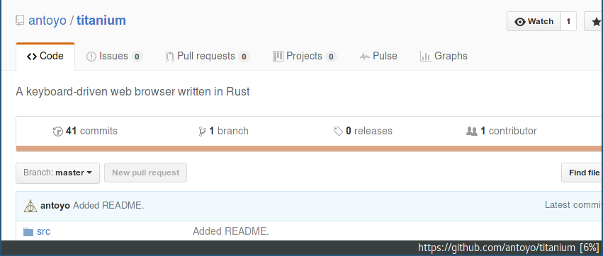
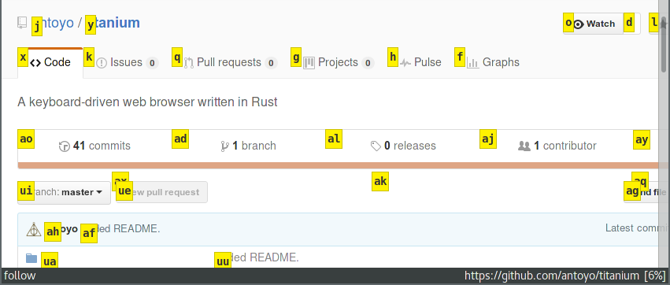

= Titanium Web Browser

A keyboard-driven web browser written in Rust

//image:https://img.shields.io/crates/v/titanium.svg[link="https://crates.io/crates/titanium"]
//image:https://img.shields.io/crates/d/titanium.svg[link="https://crates.io/crates/titanium"]
image:https://img.shields.io/crates/l/titanium.svg[link="LICENSE"]

Titanium is written in Rust and uses WebKit2GTK to render web pages.

It is inspired on Vimperator and qutebrowser.py.

== Screenshots

== Features

 * vim-like keybindings
 * follow links/scroll from the keyboard
 * pop-up blocker with blacklist and whitelist
 * user scripts and user style sheet
 * page search
 * search engines
 * download manager
 * bookmarks (with completions)
 * ad blocker

== Building

[source, bash]
----
cargo build
cd titanium-web-extension
cargo build
----

if you have issues compiling due to requiring an environment variable, set it to the web extension path

== Installing Titanium

Set the `TITANIUM_EXTENSION_INSTALL_PATH` environment variable and compile in release mode.
Then copy the executable and the library in `/usr/local`.

[source, bash]
----
sudo mkdir -p /usr/local/lib/titanium/web-extensions
export TITANIUM_EXTENSION_INSTALL_PATH=/usr/local/lib/titanium/web-extensions
cargo build --release
sudo cp target/release/titanium /usr/local/bin
cd titanium-web-extension
cargo build --release
sudo cp target/release/libtitanium_web_extension.so /usr/local/lib/titanium/web-extensions/
----
